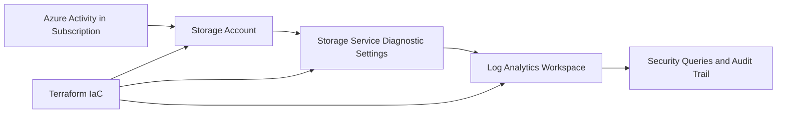

# Architecture

## Phase 1 Overview

Phase 1 establishes an auditable Azure foundation with a monitored storage resource.

## Components

- `azurerm_resource_group`: scope for core Phase 1 resources.
- `azurerm_storage_account`: monitored resource equivalent to S3.
- `azurerm_monitor_diagnostic_setting`: sends storage logs to Log Analytics.
- `azurerm_log_analytics_workspace`: centralized retention and query plane.

## Handoff to Phase 2

Phase 1 outputs provide resource IDs and workspace references needed to implement event detection rules in Phase 2.
