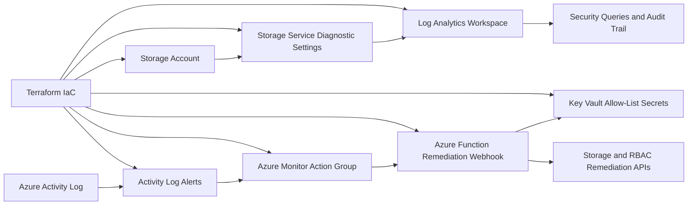

# Architecture

## Phase 1 to Phase 3 Overview

Phase 1 establishes an auditable Azure foundation with a monitored storage resource.
Phase 2 adds native Azure event detection and consistent signal routing.
Phase 3 adds a managed-identity remediation runtime.

## Components

- `azurerm_resource_group`: scope for core Phase 1 resources.
- `azurerm_storage_account`: monitored resource equivalent to S3.
- `azurerm_monitor_diagnostic_setting`: sends storage logs to Log Analytics.
- `azurerm_log_analytics_workspace`: centralized retention and query plane.
- `azurerm_monitor_action_group`: routing target for detection signals.
- `azurerm_monitor_activity_log_alert`: event detection for security-relevant control plane changes.
- `azurerm_linux_function_app`: remediation runtime.
- `azurerm_key_vault`: secrets storage for remediation allow-lists.
- `azurerm_role_assignment`: least-privilege permissions for managed identity remediation actions.

## Phase 2 Detection Rules

- Storage account configuration writes: catch management-plane changes to the monitored resource.
- RBAC role assignment writes: catch privileged access grants in the protected scope.
- RBAC role assignment deletes: catch role removal events that may indicate unauthorized access changes.

## Phase 3 Remediation Flow

Phase 3 uses the Action Group webhook contract from Phase 2.

The remediation function:

- receives alert payloads
- evaluates event operation type
- enforces storage safe configuration settings
- removes non-allow-listed RBAC role assignments

The function uses managed identity for Azure API access and retrieves allow-lists from Key Vault.
