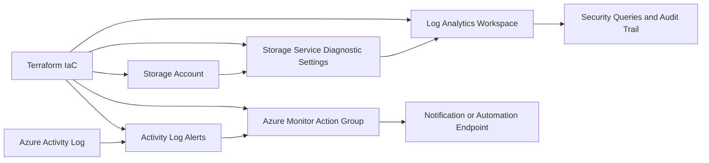

# Architecture

## Phase 1 and Phase 2 Overview

Phase 1 establishes an auditable Azure foundation with a monitored storage resource.
Phase 2 adds native Azure event detection and consistent signal routing.

## Components

- `azurerm_resource_group`: scope for core Phase 1 resources.
- `azurerm_storage_account`: monitored resource equivalent to S3.
- `azurerm_monitor_diagnostic_setting`: sends storage logs to Log Analytics.
- `azurerm_log_analytics_workspace`: centralized retention and query plane.
- `azurerm_monitor_action_group`: routing target for detection signals.
- `azurerm_monitor_activity_log_alert`: event detection for security-relevant control plane changes.

## Phase 2 Detection Rules

- Storage account configuration writes: catch management-plane changes to the monitored resource.
- RBAC role assignment writes: catch privileged access grants in the protected scope.
- RBAC role assignment deletes: catch role removal events that may indicate unauthorized access changes.

## Handoff to Phase 3

Phase 2 produces the Action Group and alert IDs that Phase 3 can connect
to an Azure Function or webhook-based remediation endpoint.
