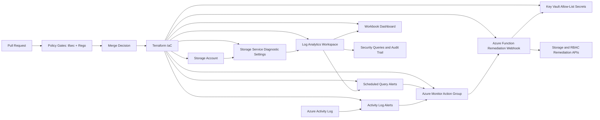

# Architecture

## Phase 1 to Phase 5 Overview

Phase 1 establishes an auditable Azure foundation with a monitored storage resource.
Phase 2 adds native Azure event detection and consistent signal routing.
Phase 3 adds a managed-identity remediation runtime.
Phase 4 adds centralized reporting alerts and trend dashboards.
Phase 5 adds policy-as-code merge gates for Terraform and guardrails.

## Components

- `azurerm_resource_group`: scope for core Phase 1 resources.
- `azurerm_storage_account`: monitored resource equivalent to S3.
- `azurerm_monitor_diagnostic_setting`: sends storage logs to Log Analytics.
- `azurerm_log_analytics_workspace`: centralized retention and query plane.
- `azurerm_monitor_action_group`: routing target for detection signals.
- `azurerm_monitor_activity_log_alert`: event detection for security-relevant control plane changes.
- `azurerm_linux_function_app`: remediation runtime.
- `azurerm_key_vault`: secrets storage for remediation allow-lists.
- `azurerm_role_assignment`: least-privilege permissions for managed identity remediation actions.
- `azurerm_monitor_scheduled_query_rules_alert_v2`: query-based observability alerts.
- `azurerm_application_insights_workbook`: dashboard reporting for security trends.
- `tfsec` workflow gate: Terraform security checks in PR workflow.
- `OPA/Rego` policies: versioned guardrail definitions for review and governance.

## Phase 2 Detection Rules

- Storage account configuration writes: catch management-plane changes to the monitored resource.
- RBAC role assignment writes: catch privileged access grants in the protected scope.
- RBAC role assignment deletes: catch role removal events that may indicate unauthorized access changes.

## Phase 3 Remediation Flow

Phase 3 uses the Action Group webhook contract from Phase 2.

The remediation function:

- receives alert payloads
- evaluates event operation type
- enforces storage safe configuration settings
- removes non-allow-listed RBAC role assignments

The function uses managed identity for Azure API access and retrieves allow-lists from Key Vault.

## Phase 4 Observability Flow

Phase 4 monitors centralized telemetry to provide operational visibility.

- Scheduled query alerts watch security event volume and remediation failures.
- Alert notifications route through the same Action Group used by detection.
- Workbook views chart event and remediation trends for audit and reporting.

## Phase 5 Policy Flow

Phase 5 codifies governance in the CI path before merge.

- `tfsec` scans Terraform for insecure patterns.
- Rego policies are versioned with infrastructure code for auditability.
- PRs are blocked when policy gates fail.
